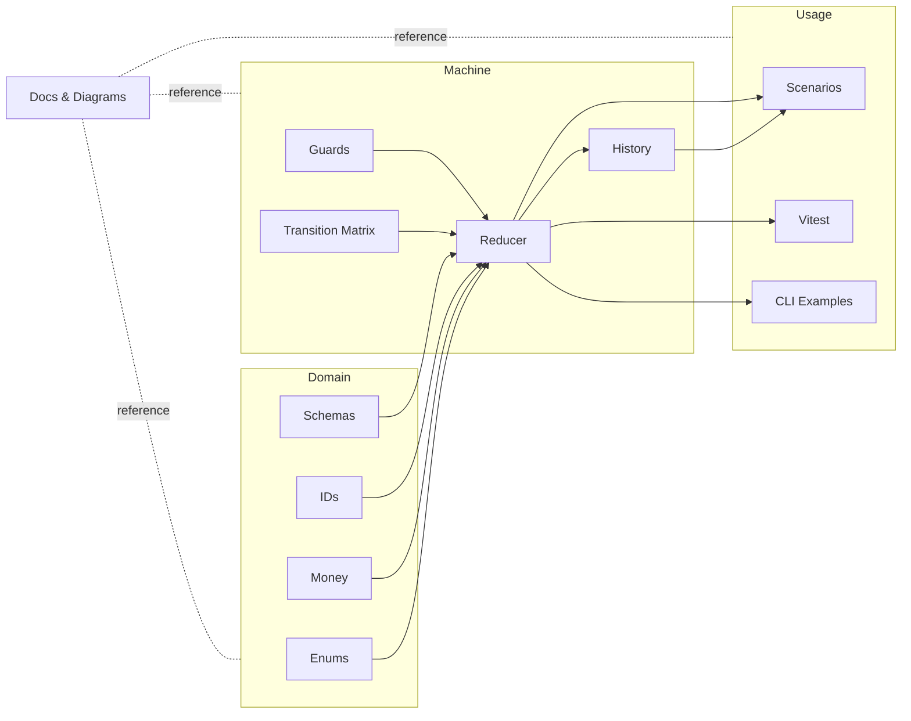

# Payment State Machine

Opinionated, production-style reference for modeling POS/payment lifecycle state transitions with retries, offline flows, partial failures, and reconciliation realities.

## Why this exists
Payment systems are distributed systems with financial consequences. Each retry, timeout, and duplicate request can move real money. This repo packages a pragmatic state model that surfaces those risks instead of hiding them behind SDK defaults.

## The problem in payment systems
- Duplicate requests are not bugs—they become double charges without idempotency.
- Offline success and financial success diverge until the processor confirms capture.
- Processor timeouts leave merchants unsure whether to retry or wait.
- Reconciliation is not bookkeeping; it is the moment application truth meets processor truth.

## Why state modeling matters in payments
Payments are long-running, multi-party workflows. Explicit states make it possible to:
- Gate retries and prevent double charges via idempotency keys.
- Isolate offline optimism from settled truth.
- Separate operational steps (capture, refund, void) from financial confirmation (settlement, reconciliation).
- Audit every transition through an immutable event history.

## What this repo includes
- Normalized enums for payment states/events.
- Pure reducer with transition validation and idempotency-aware history.
- Domain value objects (money, ids) with Zod schemas for shape validation.
- Scenario runners for realistic flows (happy path, duplicate auth, offline sync, partial refund, reconciliation mismatch).
- Vitest suite covering valid flows, invalid transitions, duplicates, offline behavior, and reconciliation mismatches.
- Mermaid diagrams for lifecycle, offline sync, and reconciliation paths.

## Why this is different
- Not a gateway.
- Not a processor SDK wrapper.
- Not a toy FSM.
- Focused on financial correctness under edge cases.

## Core Concept – Reversible Drift Window
The Reversible Drift Window is the span between provisional success (auth accepted, capture requested, offline queued) and settlement truth where outcomes can still reverse. This repo keeps that window explicit with interim states like `CAPTURE_PENDING`, `OFFLINE_QUEUED`, and `RECONCILIATION_PENDING`, and advances or rolls back only when processor sync or settlement results arrive. Idempotent event handling and reconciliation-aware transitions keep receipts, inventory, and ledgers aligned even when the processor disagrees later.

## Architecture overview
- **Domain**: value objects (`money`, ids), enums, schemas.
- **Machine**: transition matrix + reducer + guards enforcing currency/amount rules and invalid-transition rejection.
- **History**: per-payment log storing actor, idempotency key, timestamp, and resulting state.
- **Scenarios**: composable event sequences to simulate real terminal/processor behavior.
- **Docs**: lifecycle rationale, edge cases, reconciliation notes, and diagrams.

### Overall architecture diagram


## Example lifecycle
1. `REQUEST_AUTH` → `AUTHORIZING`
2. `AUTH_APPROVED` → `AUTHORIZED`
3. `CAPTURE_REQUESTED` → `CAPTURE_PENDING`
4. `CAPTURE_SUCCEEDED` → `CAPTURED`
5. `SETTLEMENT_RECEIVED` → `RECONCILIATION_PENDING`
6. (optional second settlement or operator confirmation) → back to `CAPTURED`

## Edge cases modeled
- Duplicate auth attempts with idempotency replay.
- Offline queue then sync (success and failure).
- Capture timeout then retry.
- Partial refund vs. full refund validation.
- Reconciliation mismatch after settlement file variance.
- Dispute entry point.

## Running locally
```bash
npm install
npm run scenarios   # run example flows in the console
```

## Tests
```bash
npm test
```

## Future work
- Add settlement amount deltas to reconciliation payloads.
- Model chargeback lifecycles beyond dispute-opened.
- Provide optional persistence adapters (database or event store) around the reducer.
- Extend scenarios with tip adjust and split-tender flows.
